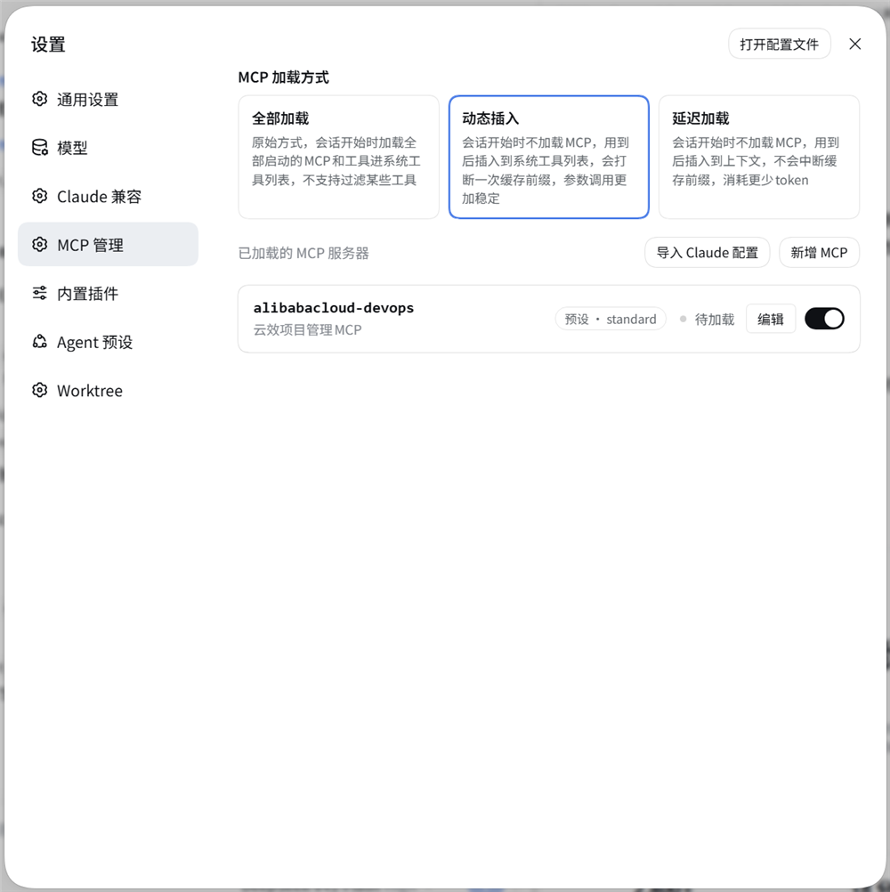
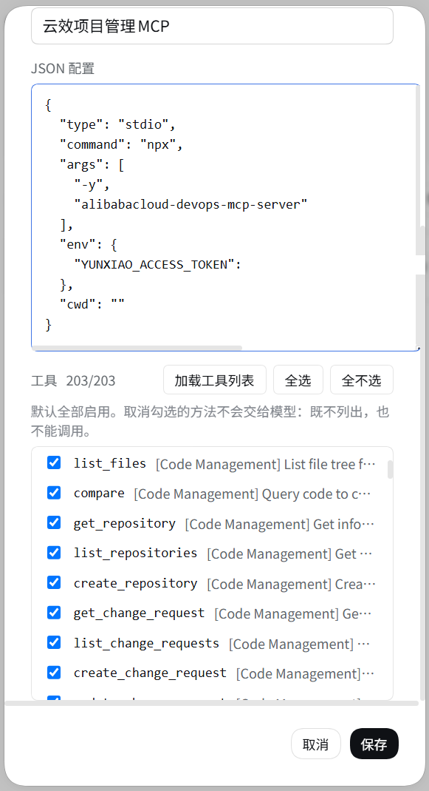
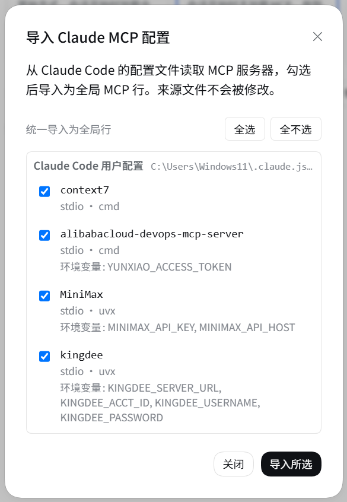

# @guowenzhang/dsh-mcp-manager

[中文](README.zh.md) | English

## Background: DeepSeek Harness

DeepSeek Harness (`dsh`) is the open-source agent harness from DeepSeek AI, where nearly every capability is a plugin on [Cordis](https://github.com/cordiverse/cordis). It is in **developer preview** and iterating fast, so expect compatibility-breaking changes ([docs](https://deepseek-harness.github.io/deepseek-harness/), `0.1.7-alpha.*`); this plugin is a standalone third-party package that resolves `@deepseek-ai/*` from the running host.

## The problem this plugin solves

MCP servers were hand-written composition rows whose whole tool set always sat in context, and an existing Claude Code setup had to be retyped; this plugin manages the rows from the settings page, loads a server on demand with only the tools you pick, and imports your Claude MCP configuration in one click.

## Screenshots

### 设置 → MCP 管理 — loading modes and server rows



The three loading modes and the configured servers, each row carrying its plane, live status, Edit, and enable switch.

### 新增 MCP — the JSON configuration and the tool picker



A server's JSON configuration, and the tools it publishes: every one is ticked by default, and an unticked method never reaches the model.

### 导入 Claude MCP 配置 — pick the servers to bring over



Every MCP server found in the Claude Code configuration files; the ticked ones are imported as global rows.

## Install

```sh
npx @deepseek-ai/dsh plugin --profile web add @guowenzhang/dsh-mcp-manager
```

From the npm registry: <https://www.npmjs.com/package/@guowenzhang/dsh-mcp-manager> — restart the host afterwards; local checkouts, git sources and troubleshooting are in [AGENTS.md](AGENTS.md).

## Usage

### Loading modes

The enable switch says **whether a server may be used**; the mode says **when an allowed server enters context**. Set it in **设置 → MCP 管理 → MCP 加载方式**; the choice is stored in the `mcp-manager` settings namespace and applies from the next request on.

| Mode | Behavior |
|---|---|
| Load all (`eager`) | Allowed servers mount at session start; their tools are always in the request |
| Dynamic insert (`dynamic`, default) | They stay unmounted; `mcp_load` mounts one into the calling session — best tool binding, but the tool list changes once per load. A filtered row mounts only its visible tools |
| Lazy (`lazy`) | `mcp_load` connects without registering anything and returns the tool schemas, called through the fixed `mcp_call` proxy — the tool list never changes, so the request-cache prefix is never invalidated |

Under `dynamic` / `lazy` the system prompt lists every loadable server as `name — the description you wrote on its row`, and the model calls `mcp_load` / `mcp_unload` by name. Names are always listed; descriptions are truncated to 80 characters under a 900-character budget. **Load state is deliberately absent** — reporting it would rewrite the system prompt on every `mcp_load` and invalidate the whole cache prefix.

Connections are per-session: a repeated `mcp_load` reuses one, different sessions each get their own, and a session that ends closes what it opened; `eager` shares one standing instance instead. Toggling a row shows a brief `starting / stopping` state while the child process comes up.

### Tool filters

Settings → MCP 管理 → a row's **Edit** → the **Tools** tab lists every method the server publishes, all checked. Unchecking one hides it: it never enters context, and calling it is refused. Filtering does not change the cost model — the loading mode decides that.

For wildcards, write the rules yourself in the `mcp-manager` settings under `tools`, keyed by the row key (`preset:<preset id>:<serverName>`):

| Form | Meaning |
|---|---|
| `create_workitem` | **Allow list**: one entry without `!` keeps only matching tools |
| `!delete_*` | **Deny list**: when every entry starts with `!`, matching tools are hidden |
| `*`, `?` | Wildcards: `*` matches any run of characters, `?` matches exactly one |

Rules are read at the next `mcp_load`; an already-loaded server keeps the tools it was admitted with. `eager` ignores filters, and an unparsable rule set hides nothing.

### Importing a Claude Code configuration

**设置 → MCP 管理 → 导入 Claude 配置** reads the files Claude Code writes and offers every server it finds as a checklist; ticked servers are imported as **global** rows.

| Source | File |
|---|---|
| Claude Code user config | `~/.claude.json` → `mcpServers` |
| Per-directory scope inside it | `~/.claude.json` → `projects["<working directory>"].mcpServers` |
| Claude Code settings | `~/.claude/settings.json`, `settings.local.json` |
| Project scope | `<project root>/.mcp.json` |

Nothing is modified — the scan only reads — and each server is imported on its own, so one failure does not stop the rest. `env` / `headers` come along so the server can connect, but the dialog shows only those keys' names.

## Notes and caveats

- **Enabling a server still waits on the child process** (`npx -y …` / `uvx …`, usually 1–3 seconds). The UI never blocks; installing the server as a direct executable shortens this noticeably.
- **Switching to the edit dialog's Tools tab connects to that server once** (to list its tools), with the same 1–3 second cost; renaming a row only never connects.
- **Global-plane rows ignore the loading mode**: they always mount.
- **A preset's first mount starts and then kills each server once.** On-demand loading works by unmounting rows at runtime, which cannot beat the child process's spawn, so the first session to use a preset after a host restart pays one short start-up.
- **Import reads Claude Code and the project `.mcp.json` only.** Cursor, Cline, Roo, and VS Code configuration files are not scanned, and an import always targets the global plane; move a row into a preset afterwards if you want it on-demand.
- **A filtered row under `dynamic` gets no server instructions and no resource tools.** The harness's mcp-client provides both, and this row registers through the plugin's own carrier instead. The tools themselves — argument binding, results, image projection — match a native mount.

## License

Apache License 2.0 — see [LICENSE](LICENSE). This project includes MIT-licensed portions derived from DeepSeek Harness; see [NOTICE](NOTICE).

## Further reading

- [AGENTS.md](AGENTS.md) — full install variants, build and wiring, deployment and live-update semantics, release steps, the traps, and the tests.
- [docs/design-decisions.md](docs/design-decisions.md) — why three loading modes, which alternatives were rejected, and how Claude's tool search compares.
- [docs/competitive-landscape.md](docs/competitive-landscape.md) — comparison with other DSH MCP plugins and the feature roadmap it produces.
- [DeepSeek Harness documentation](https://deepseek-harness.github.io/deepseek-harness/).
