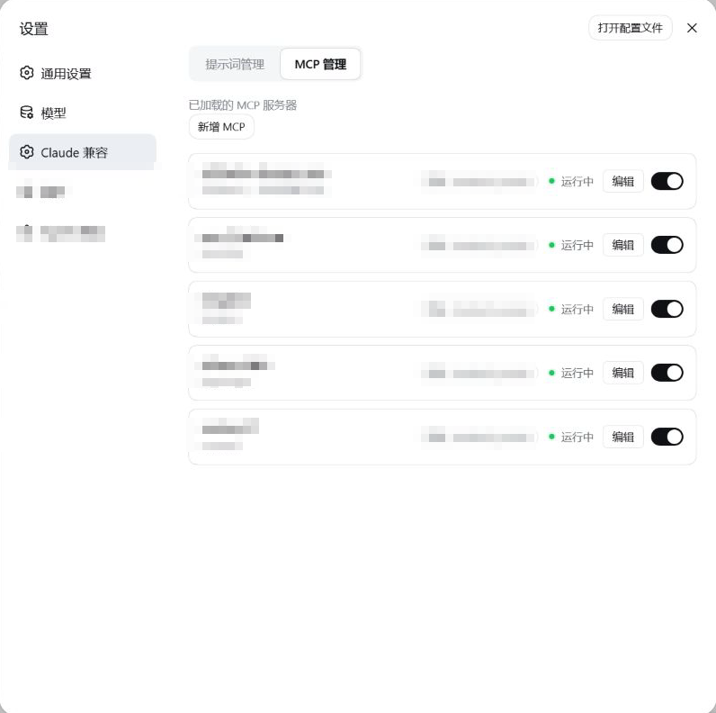
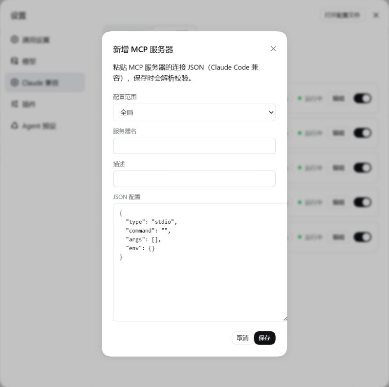

# @zhang-guo-wen/dsh-mcp-manager

中文 | [English](README.md)

## 这个插件有什么用

- **MCP 管理。** 在设置页里新增、编辑、启停 MCP 服务器。全局行与各 preset 的行都会列出并显示实时状态。切换时显示
  短暂的 `启动中 / 停止中`，因为要等 MCP 子进程起来，列表不会因此卡住。
- **按需加载 MCP。** 停用的服务器不占任何开销。模型可调用 `mcp_list`、`mcp_load`、`mcp_unload`，**只为当前会话**
  启动某台服务器；已加载的工具不会漏到别的会话。连接按会话隔离：不同会话各起一份；会话结束后，它为这台服务器
  建立的连接会自动关闭。
- **MCP 工具过滤。** 在 MCP 的编辑弹窗里列出这台服务器提供的方法，**默认全部勾选**；取消勾选的方法不会进上下文 ——
  既不列出也不能调用。需要通配符时也可以手写 `mcp-manager.tools`。
- **导入已有的 Claude Code 配置。** 一个按钮读取你的 Claude Code 配置文件里已经声明的 MCP 服务器，勾选后导入为
  全局行 —— 不用重新敲一遍命令、参数和 API key。

MCP 服务器管理是从 [`dsh-claude-compat`](https://github.com/zhang-guo-wen/dsh-claude-compat) 拆出来的独立插件：
两者互不依赖，可以只装其中一个。两个都装时，设置页会出现「Claude 兼容」与「MCP 管理」两个独立区块。

## 截图

### MCP 管理 —— 列出全部已配置服务器，状态实时



### MCP 管理 —— 新增或编辑服务器，含工具勾选



## 安装

构建好的 `lib/` 随仓库提交，所以装完即可运行，**你这边不需要构建**。

```sh
# HTTPS
npx @deepseek-ai/dsh plugin --profile web add git+https://github.com/zhang-guo-wen/dsh-mcp-manager.git

# 或 SSH
npx @deepseek-ai/dsh plugin --profile web add git+ssh://git@github.com/zhang-guo-wen/dsh-mcp-manager.git
```

建议锁定发布 tag，这样默认分支上后续的临时提交不会被人拿到：

```sh
npx @deepseek-ai/dsh plugin --profile web add "git+ssh://git@github.com/zhang-guo-wen/dsh-mcp-manager.git#v0.1.0"
```

对着本地 checkout 开发就装目录，pnpm 会建**软链**，重建 `lib/` 后下次启动即生效：

```sh
npx @deepseek-ai/dsh plugin --profile web add /绝对路径/dsh-mcp-manager
```

## 使用

### MCP 加载方式

行上的启停开关与加载模式回答两个不同问题：开关决定**这台服务器能不能用**，模式决定**允许的服务器什么时候进上下文**。

| 模式 | 行为 |
|---|---|
| 全部加载（`eager`） | 允许的服务器在会话开始时就挂载，工具始终在请求里 |
| 动态插入（`dynamic`，默认） | 允许的服务器默认**不挂载**；`mcp_load` 把一台挂进调用方会话，工具随之加入请求 —— 绑定质量最好，但工具列表每次加载会变一次 |
| 惰性（`lazy`） | 允许的服务器默认**不挂载**；`mcp_load` 用 MCP SDK 直连且**不注册任何工具**，只返回工具 schema，模型通过固定的 `mcp_call` 代理调用 —— 工具列表永不变，请求缓存前缀零失效 |

在 **设置 → Harness 兼容 → MCP 管理 → MCP 加载方式** 里选择。该选择存在用户的 `mcp-manager` 设置命名空间，
提交后**从下一个请求起对所有会话生效**。

### 进程与生命周期

`dynamic` / `lazy` 下，没有加载的服务器**一个进程都不启动** —— 会话开始时 MCP 是停的，直到某次 `mcp_load`。

加载之后，连接按会话隔离：同一会话重复 `mcp_load` 复用同一份，**不同会话各起一份**（stdio 就是各一个子进程），
子 agent 和 fork 出的会话都算独立会话。**会话结束后，该会话建立的连接会自动关闭**，不需要手动 `mcp_unload`。
`eager` 相反 —— preset 是常驻挂载，全局共享一个实例，所有会话共用。

> 配在**全局平面**（直接写进 `cordis.yml`）的 MCP 行不归按需加载管：它们总是启动，相当于永远 `eager`。
> 想让一台服务器按需加载，就把它配在 preset 里。

### MCP 工具过滤

一台服务器动辄几十个工具，常用的可能只有几个。过滤之后，**加载这台服务器时只有留下的工具会交给模型**：
被隐藏的工具不出现在 `mcp_load` 的结果里，也不能用 `mcp_call` 调用（调用会被直接拒绝）。

**在设置页操作：**设置 → Harness 兼容 → MCP 管理 → 某一行的**编辑** → 弹窗底部的**工具**区块。

打开时会连一次这台服务器，把它提供的方法列出来，**默认全部勾选**。取消勾选的方法即被禁用，保存后生效。
区块上有 `启用数/总数` 计数、`加载工具列表`（改完 JSON 后重新读）、`全选` / `全不选`。

- 列表只在**服务器应答过**时才写回规则；连不上时保存不会改动已有规则。
- 全部勾选 = 这条规则被清空，该服务器的工具全部可见（也是新增服务器时的状态）。

**需要通配符时手写：**规则存在 `mcp-manager` 设置命名空间的 `tools` 字段里，键是行标识
（`preset:<preset id>:<serverName>`，与描述同键）：

| 写法 | 含义 |
|---|---|
| `create_workitem`、`get_workitem` | **白名单**：只要有一个不带 `!` 的条目，就只有匹配它的工具可见 |
| `!delete_*` | **黑名单**：条目全是 `!` 开头时，匹配的隐藏，其余保留 |
| `*`、`?` | 通配符：`*` 匹配任意长度的字符，`?` 匹配单个字符 |

UI 保存的正是展开后的黑名单，例如取消勾选 `delete_workitem` 会写成：

```yaml
mcp-manager:
  tools:
    "preset:standard-yunxiao:alibaba-devops-mcp":
      - "!delete_workitem"
```

几件需要知道的事：

- **规则在加载时读取。** 改完设置后对**下一次 `mcp_load`** 生效；已加载的服务器保持加载时那套工具，`mcp_unload` 后再
  `mcp_load` 即可换到新规则。
- **配了规则的行总是走代理通道**（`mcp_load` 列目录 + `mcp_call` 调用），即使加载模式是 `dynamic`。原生注册会把整台服务器
  的工具一起挂上，没有"只挂一部分"的接口。
- **`eager` 下规则不生效**，因为该模式由 harness 的 mcp-client 直接挂载整台服务器；启动时会记一条警告说明。
- **写坏的规则不隐藏任何东西**：无法解析的值按"不过滤"处理，拼错不会让一台服务器的工具凭空消失。

### 导入已有的 Claude Code 配置

**设置 → Harness 兼容 → MCP 管理 → 导入 Claude 配置** 会读取 Claude Code 自己写的配置文件，把找到的服务器列成
勾选清单，勾中的导入为**全局**行。

| 来源 | 文件 |
|---|---|
| Claude Code 用户配置 | `~/.claude.json` 的 `mcpServers` |
| 其中的按目录分区 | `~/.claude.json` 的 `projects["<工作目录>"].mcpServers` |
| Claude Code 设置 | `~/.claude/settings.json`、`settings.local.json` |
| 项目级 | `<项目根>/.mcp.json` |

`type` 可以省略（Claude Code 自己就是这么写的）：有 `command` 即 stdio，有 `url` 即 streamable HTTP。

- **不改动任何来源文件。** 扫描只读；只有你勾中的行会被写入，且走的是与手工新增**完全相同**的路径
  （同样的校验、冲突检测与原子写）。
- **名字已被占用的服务器默认不勾选**；无法导入的会直接标出原因，而不是静默失败。
- **每台独立导入。** 其中一台失败不影响其余，失败项会在结束时连同原因一起列出。
- **凭据会一并带过来。** 条目里的 `env` / `headers` 原样导入，服务器才连得上；弹窗只显示这些键的**名字**，
  不显示值。

## 配置

| 字段 | 默认 | 含义 |
|---|---|---|
| `mcpLoading` | `dynamic` | 允许的服务器默认怎么进上下文；设置页的选择覆盖它 |

```yaml
- name: '@zhang-guo-wen/dsh-mcp-manager'
  config:
    mcpLoading: lazy
```

## 已知限制

- **启用 MCP 仍需等子进程自身启动**（`npx -y …` / `uvx …` 通常 1–3 秒）。界面不会卡住；把服务器装成直接可执行文件
  能明显缩短这个时间。
- **每次打开编辑弹窗会连一次该服务器**（为了列出工具），同样是 1–3 秒。
- **全局平面的行不受加载模式管辖**：它们总是挂载。
- **预设首次挂载时会有一次"启动后又杀掉"**：按需加载靠运行时摘行实现，抢在子进程启动之前拦不住，所以每次
  宿主重启后第一次使用某个 preset 时会有这一下。
- **导入只读 Claude Code 与项目的 `.mcp.json`**：不扫 Cursor / Cline / Roo / VS Code 的配置文件；且导入一律落在
  全局平面，想要按需加载请在导入后把该行移进 preset。

## 开发

构建方式、Cordis/Typert 插件契约、各处的坑与 MCP 生命周期细节见 [AGENTS.md](AGENTS.md)。
加载相关的设计决策(为什么是三种模式、否决过哪些替代方案、Claude 的 tool search 对照)见
[docs/design-decisions.md](docs/design-decisions.md)。同类插件的对比与下一步功能路线图见
[docs/competitive-landscape.md](docs/competitive-landscape.md)。

```sh
npm run build      # host（tsdown）+ client（rolldown ModuleLoader handoff）
npm run typecheck
npm test           # vitest；必须带仓根自带的 vitest.config.ts
```

## 许可

Apache License 2.0 —— 见 [LICENSE](LICENSE)。本项目包含源自 DeepSeek Harness 的 MIT 许可部分，见 [NOTICE](NOTICE)。
