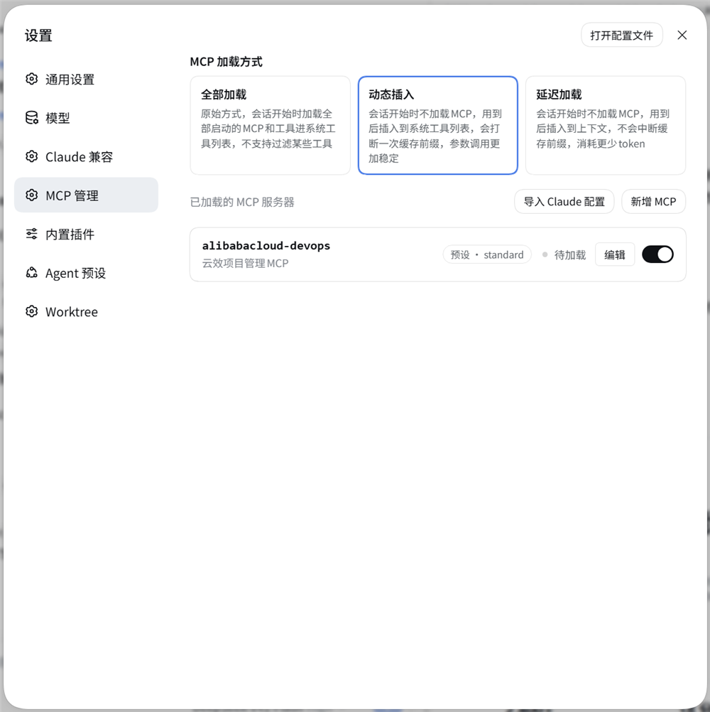
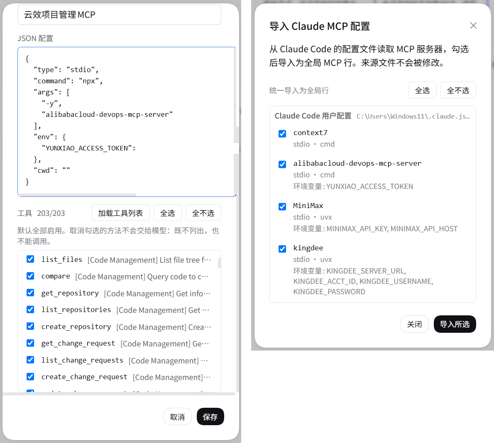

# @guowenzhang/dsh-mcp-manager

中文 | [English](README.md)

在 DeepSeek Harness 设置页集中管理 MCP：新增或编辑连接、选择 Agent 预设的加载方式、筛选模型可用的工具，并批量导入已有的 Claude Code 配置。

## 背景：DeepSeek Harness

DeepSeek Harness（`dsh`）是 DeepSeek AI 开源的 agent harness，几乎所有能力都是 [Cordis](https://github.com/cordiverse/cordis) 插件。它处于 **developer preview** 阶段、迭代很快，会有破坏性变更（[文档站](https://deepseek-harness.github.io/deepseek-harness/)，`0.1.7-alpha.*`）；本插件是独立第三方包，`@deepseek-ai/*` 运行时从宿主解析。

## 这个插件解决什么问题

MCP 服务器原本只能手写组合行、整套工具常驻上下文，已有的 Claude Code 配置还得照着重敲；本插件在设置页管理这些行，按需加载某台服务器且只加载你勾选的那部分工具，还能一键导入 Claude 的 MCP 配置。

## 截图

### MCP 管理页



集中查看服务器状态、编辑连接配置、切换启用开关。Agent 预设中的服务器支持三种加载方式；全局行始终加载。

### 配置服务器与导入 Claude MCP

[](docs/images/mcp-editor-import.png)

- **左图：配置与工具勾选**。粘贴服务器的 JSON 配置，选择允许模型使用的工具。工具过滤仅对 Agent 预设行的 `dynamic` / `lazy` 模式生效，全局行与 `eager` 模式不支持过滤。
- **右图：导入 Claude 配置**。扫描已有的 Claude Code 配置，勾选服务器后批量导入，不修改来源文件。导入位置跟随当前的 **全局 / Agent** 标签；在 Agent 标签下可选择目标预设。

两张弹窗横向并排展示，点击图片可查看原尺寸。截图为早期界面示例：当前编辑器已将「配置 / 工具列表」分为两个标签，导入也不再限定为全局行。

## 安装

```sh
npx @deepseek-ai/dsh plugin --profile web add @guowenzhang/dsh-mcp-manager@^1.0.1
```

前置条件：`pnpm` 在 `PATH` 上（`dsh plugin` 会把参数转发给它），Node.js 用 ≥22.18 或 ≥24.2 —— v23.x 下 `dsh` CLI 会静默退出、什么都不装（[讨论 #6273](https://github.com/deepseek-ai/deepseek-harness/discussions/6273)）。`@^1.0.1` 这个下限是有意的：pnpm 11 默认拒绝发布不满 24 小时的新版本，只写包名会解析到 1.0.0，而它缺少 `@deepseek-ai/schemastery` 依赖。

来自 npm 官方源：<https://www.npmjs.com/package/@guowenzhang/dsh-mcp-manager>。装完重启宿主；本地目录开发安装、git 源与排查见 [AGENTS.md](AGENTS.md)。

## 宿主兼容性

本地源码已适配移除 `livePresetMounts` 的新注册表（验证版本：DSH `0.2.1-alpha.1`），并保留按需加载、预设代次和会话隔离。运行时 MCP SDK 由本插件依赖提供，不要求新版宿主继续携带旧 SDK。此修复尚未发布到 npm，以上 npm 命令不会取得本地未发布的修改。

本地 `link:` 安装重建后需要重启宿主，再刷新浏览器；只刷新页面不会替换已经加载的 Host 代码。如果宿主将旧版 `@deepseek-ai/dsh-mcp-client` 行判为不兼容，管理页会保留这些行并显示禁用状态；需要另行更新该客户端，插件不会绕过宿主的兼容性检查。

## 用法

### 加载方式

启用开关说的是**这台服务器允不允许用**，加载方式说的是**允许的服务器什么时候进上下文**。在 **设置 → MCP 管理 → MCP 加载方式** 里选；选择存在 `mcp-manager` 设置命名空间，从下一个请求起对所有会话生效。

| 模式 | 行为 |
|---|---|
| 全部加载（`eager`） | 允许的服务器在会话开始时就挂载，工具始终在请求里 |
| 动态插入（`dynamic`，默认） | 允许的服务器默认不挂载；`mcp_load` 把一台挂进调用方会话——绑定质量最好，但工具列表每次加载会变一次。配了工具过滤的行只挂可见工具 |
| 惰性（`lazy`） | `mcp_load` 只连不注册，把工具 schema 作为结果返回，模型经固定的 `mcp_call` 代理调用——工具列表永不变，请求缓存前缀零失效 |

`dynamic` / `lazy` 下，系统提示按 `名字 — 你在这行写的描述` 列出每一台可加载的服务器，模型按名字调 `mcp_load` / `mcp_unload`。名字永远列全；描述单条截断到 80 字符、整段预算 900 字符。**加载状态刻意不写**——写它会让每次 `mcp_load` 都重写系统提示，整个缓存前缀失效。

连接按会话隔离：同一会话重复 `mcp_load` 复用一份，不同会话各起一份，会话结束会关掉它开的连接；`eager` 相反，共享一个常驻实例。切换某一行的开关时先短暂显示 `启动中 / 停止中`，因为要等子进程起来。

`dsh-resource-manager` 提供的资源仓库 MCP 也使用这三种模式，包括全局资源。资源管理器仍负责同步与凭据；它的 MCP Tab 会显示托管状态和当前模式。资源 MCP 不写入用户的组合文件，也不作为可编辑的组合行出现在本页。

### 工具过滤

设置 → MCP 管理 → Agent 预设行的 **编辑** → **工具列表**，列出服务器发布的工具，默认全勾。`dynamic` / `lazy` 下取消勾选，下一次加载时就不会向模型提供该工具。全局行的工具列表只读，`eager` 模式忽略过滤规则。

要写通配规则就自己写，规则在 `mcp-manager` 设置的 `tools` 字段里，键是行标识（`preset:<preset id>:<serverName>`）：

| 写法 | 含义 |
|---|---|
| `create_workitem` | **白名单**：只要有一个不带 `!` 的条目，就只有匹配它的工具可见 |
| `!delete_*` | **黑名单**：条目全是 `!` 开头时，匹配的隐藏，其余保留 |
| `*`、`?` | 通配符：`*` 匹配任意长度的字符，`?` 匹配单个字符 |

规则在下一次 `mcp_load` 时读取，已经加载的服务器保持加载时那套工具。`eager` 下规则不生效，无法解析的规则什么都不隐藏。

### 导入 Claude Code 的 MCP 配置

**设置 → MCP 管理 → 导入 Claude 配置** 扫描 Claude Code 的配置文件，将找到的服务器列成勾选清单。勾选后导入当前的 **全局 / Agent** 标签；在 Agent 标签下选择目标预设。

| 来源 | 文件 |
|---|---|
| Claude Code 用户配置 | `~/.claude.json` 的 `mcpServers` |
| 其中的按目录分区 | `~/.claude.json` 的 `projects["<工作目录>"].mcpServers` |
| Claude Code 设置 | `~/.claude/settings.json`、`settings.local.json` |
| 项目级 | `<项目根>/.mcp.json` |

扫描只读，不改动来源文件；选中的服务器逐行校验，通过的行一次批量保存，一行被拒不影响其余。`env` / `headers` 会一起保留，确保服务器可连接；弹窗只显示键名。

## 注意事项

- **启用 MCP 仍需等子进程自身启动**（`npx -y …` / `uvx …` 通常 1–3 秒）。界面不会卡住；把服务器装成直接可执行文件能明显缩短这个时间。
- **切到编辑弹窗的「工具列表」tab 会连一次该服务器**（为了列出工具），同样是 1–3 秒；只改描述就不会连。
- **全局平面的行不受加载模式管辖**：它们总是挂载。
- **预设首次挂载时会有一次"启动后又杀掉"**：按需加载靠运行时摘行实现，抢在子进程启动之前拦不住；新版宿主在声明注册时激活预设，因此这次启动可能出现在宿主启动或配置重建时。
- **导入只读 Claude Code 与项目的 `.mcp.json`**：不扫 Cursor / Cline / Roo / VS Code 的配置文件。需要按需加载与工具过滤时，请从 Agent 标签导入到预设。
- **`dynamic` 下配了规则的行拿不到服务器 instructions 与资源工具**：这两样由 harness 的 mcp-client 提供，而这一行走的是插件自己的注册通道。工具本身的参数绑定、结果与图片呈现与原生挂载一致。

## 许可

Apache License 2.0 —— 见 [LICENSE](LICENSE)。本项目包含源自 DeepSeek Harness 的 MIT 许可部分，见 [NOTICE](NOTICE)。

## 延伸阅读

- [AGENTS.md](AGENTS.md) —— 完整的安装变体、构建与接线、部署与生效语义、发版步骤、易崩清单与测试。
- [docs/design-decisions.md](docs/design-decisions.md) —— 为什么是三种加载模式、否决过哪些替代方案、Claude 的 tool search 如何对照。
- [docs/competitive-landscape.md](docs/competitive-landscape.md) —— 同类 DSH MCP 插件对比与由此产生的功能路线图。
- [DeepSeek Harness 文档](https://deepseek-harness.github.io/deepseek-harness/)。
